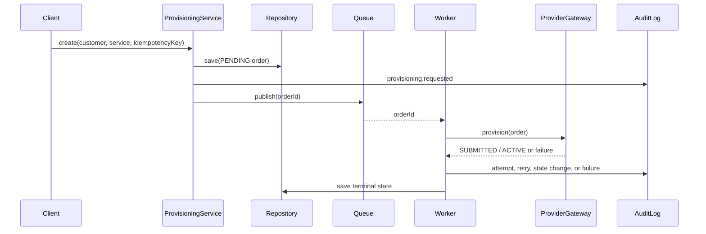

# Telecom Provisioning Reference

Clean-room PHP reference implementation for an idempotent, asynchronous service-provisioning workflow.

This repository is an original portfolio project. It uses synthetic identifiers and a provider interface; it contains no Atom Telecom source code, internal terminology, customer data, credentials, or confidential architecture.

## Problem

Provisioning systems coordinate a customer request across an application, a queue, and an external provider. The difficult parts are not the happy-path database write; they are duplicate requests, provider timeouts, retry policy, state transitions, and an audit trail that explains what happened.

## Solution

The reference separates request acceptance from provider execution:

1. `ProvisioningService` validates the request, applies the idempotency key, stores a pending order, records an audit event, and publishes an order ID to a queue boundary.
2. `ProvisioningWorker` consumes the order ID, calls a provider adapter, retries transient failures up to a limit, and records terminal success or failure.
3. `ProviderGateway` keeps external-provider behaviour behind a replaceable interface.



## Key Features

- Idempotent request acceptance keyed by a caller-supplied idempotency key.
- Explicit `PENDING`, `SUBMITTED`, `ACTIVE`, and `FAILED` state model.
- Queue boundary between request acceptance and provider execution.
- Retry handling for transient provider failures with a bounded attempt count.
- Immediate terminal handling for permanent provider failures.
- Audit events for request, attempt, retry, state change, and failure.
- Provider adapter interface suitable for a real HTTP client without coupling the domain model to it.
- In-memory adapters keep the example deterministic and easy to run locally.

## Technology Stack

- PHP 8.2+
- Composer
- PHPUnit 11
- GitHub Actions across PHP 8.2, 8.3, and 8.4

The core is framework-agnostic on purpose. A Laravel HTTP/queue adapter can be added without moving provider or state-transition rules into controllers.

## API Design

An HTTP adapter is intentionally not included in the first milestone. The intended boundary is:

```text
POST /v1/provisioning-orders
Idempotency-Key: <caller-generated-key>

{
  "customer_reference": "customer-123",
  "service_reference": "service-456"
}
```

The API should return an accepted order representation and let the worker own provider execution. Authentication, authorisation, rate limiting, and request signing belong in the adapter layer and are listed as future work rather than claimed features.

## Reliability and Failure Handling

- Duplicate requests return the existing order for the same idempotency key.
- Provider timeouts are represented as transient failures and retried up to three attempts.
- Invalid service data is represented as a permanent failure and is not retried.
- State-changing methods reject illegal transitions.
- Audit context records the attempt number and terminal reason without storing secrets.

## Security

This repository contains no provider credentials and no production data. A real adapter should keep credentials in a secret manager, validate and authorise callers before creating orders, use TLS and bounded timeouts, redact sensitive provider responses, and apply rate limits. Those controls are not claimed as implemented in this reference core.

## Testing

The PHPUnit suite covers:

- duplicate idempotency keys;
- queue publication;
- transient failure followed by success;
- bounded retry behaviour;
- permanent failure without a retry;
- terminal state and audit outcomes.

## Running Locally

```bash
composer install
composer test
```

No database, queue service, provider account, or environment secret is required for the current milestone.

## Engineering Decisions

- **Framework-agnostic core:** keeps domain rules testable and prevents controllers from becoming the workflow engine.
- **Explicit worker boundary:** makes asynchronous execution and retry ownership visible without hiding behaviour behind a framework.
- **In-memory adapters first:** keeps the reference deterministic; production adapters can implement the same interfaces later.
- **No fabricated operational claims:** authentication, metrics, provider SLAs, and deployment topology remain documented future work until implemented.

## Future Improvements

- Add a Laravel HTTP adapter with authentication, authorisation, request validation, and OpenAPI documentation.
- Add a durable repository and queue adapter backed by MySQL and Redis.
- Add provider request signing, timeout policy, correlation IDs, and structured logs.
- Add an outbox or transactional message publication strategy.
- Add contract tests against a fully synthetic provider stub.
- Add dashboards and deployment examples without using real provider credentials.

## License

MIT. See [LICENSE](LICENSE).
